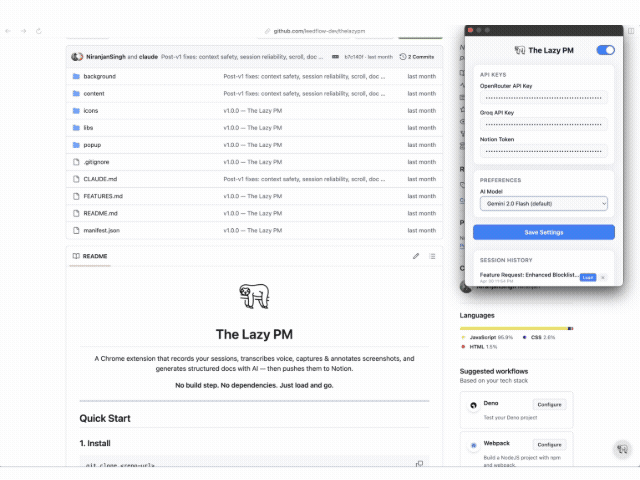
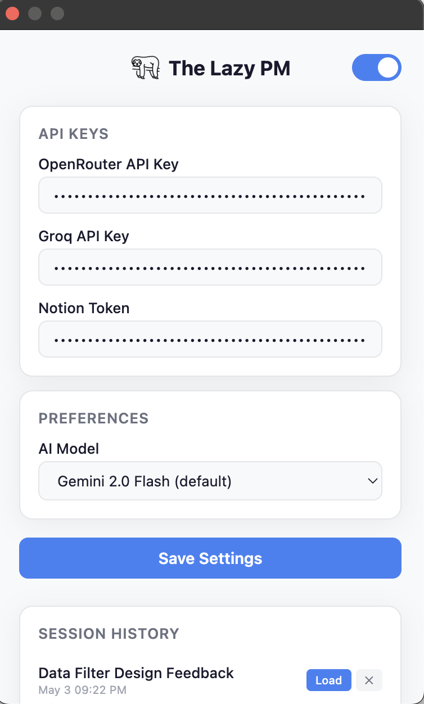
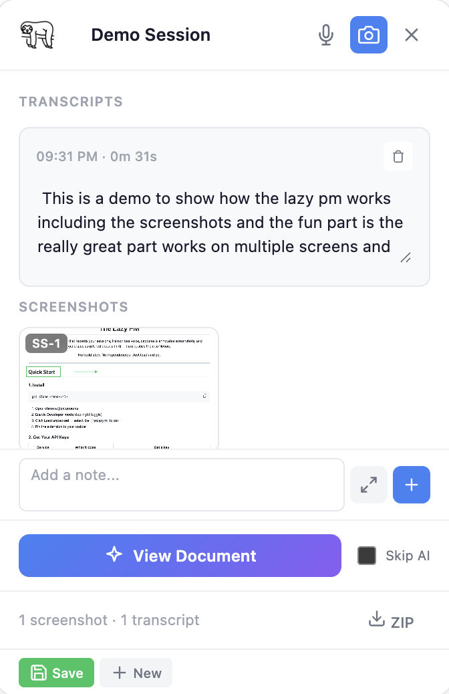
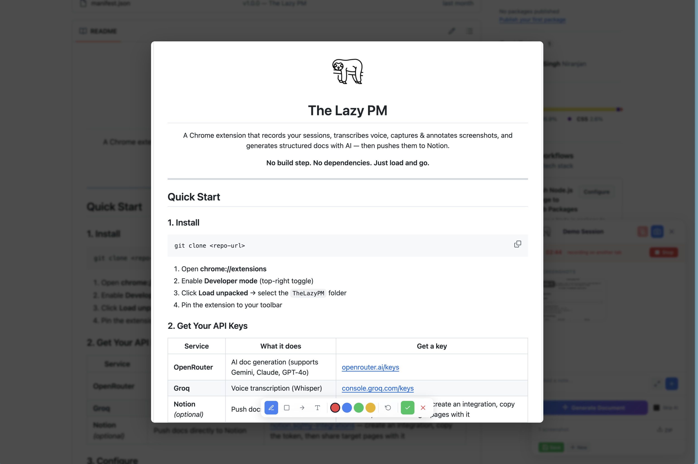
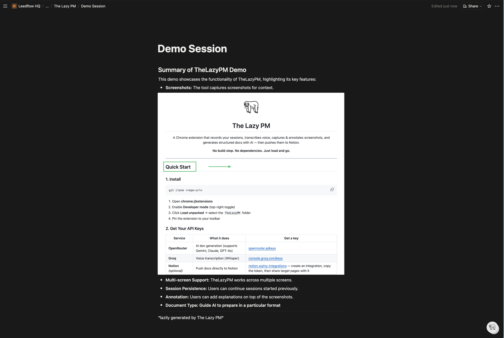

<p align="center">
  
</p>

<h1 align="center">The Lazy PM</h1>

<p align="center">
  A Chrome extension that records your sessions, transcribes voice, captures &amp; annotates screenshots, and generates structured docs with AI — then pushes them to Notion.
</p>

<p align="center">
  <b>No build step. No dependencies. Just load and go.</b>
</p>

<p align="center">
  <a href="LICENSE"></a>
  <a href="manifest.json"></a>
  <a href="CONTRIBUTING.md"></a>
</p>

---

<!-- TODO: replace with an actual recording. Drop a GIF at docs/demo.gif. -->



## ✨ Features

- 📸 **Screenshot Capture & Annotation** — Select a region, then mark it up with **highlight**, **rectangle**, **arrow**, **text**, and a **color picker**. Screenshots are timestamped and referenced inline in the generated doc.
- 🎙️ **Voice Transcription** — Record audio and Groq's Whisper API transcribes it with timestamps. Transcripts appear as editable cards — fix typos before generating the doc.
- 📝 **Text Notes** — Drop quick notes without recording. Inline input for short notes, expandable editor for longer markdown entries.
- 🤖 **AI Doc Generation** — One click turns your session into a structured document. The AI detects the session type and formats accordingly:
  - 🐛 **Bug reports** → repro steps, severity, expected vs. actual
  - 📋 **Feature specs / PRDs** → requirements, acceptance criteria, priority tags
  - 🤝 **Meeting notes** → decisions, action items, owners
  - 🎨 **Design feedback** → visual references with screenshot callouts
  - 🗒️ **General notes** → organized by topic

  Choose from Gemini 2.0 Flash (default), Gemini 2.0 Pro, Claude Sonnet 4.6, GPT-4o, or GPT-4o Mini.
- ⚡ **Skip AI Mode** — Assemble a raw doc from your notes and screenshot references — no API call, no cost, instant.
- 🔗 **Notion Integration** — Push the generated doc directly to a Notion page. Screenshots are uploaded as inline images via the Notion File Upload API — they render natively, not as external links.
- 🗂️ **Session History** — Sessions are saved locally (up to 20). Load any past session from the settings popup — transcripts, screenshots, and the generated doc are all restored.
- 🪟 **Multi-Tab Support** — Start a session on one tab, switch to another, keep recording. The widget syncs state across tabs.

---

## 🚀 Quick Start

### 1. Install

```
git clone https://github.com/Leedflow-Dev/TheLazyPM.git
```

1. Open **chrome://extensions**
2. Enable **Developer mode** (top-right toggle)
3. Click **Load unpacked** → select the `TheLazyPM` folder
4. Pin the extension to your toolbar

### 2. Get Your API Keys

| Service | What it does | Get a key |
|---------|-------------|-----------|
| **OpenRouter** | AI doc generation (supports Gemini, Claude, GPT-4o) | [openrouter.ai/keys](https://openrouter.ai/keys) |
| **Groq** | Voice transcription (Whisper) | [console.groq.com/keys](https://console.groq.com/keys) |
| **Notion** *(optional)* | Push docs directly to Notion | [notion.so/my-integrations](https://www.notion.so/my-integrations) — create an integration, copy the token, then share target pages with it |

### 3. Configure

Click the extension icon → paste your API keys → pick an AI model → **Save Settings**.

Toggle the widget **on/off** with the switch in the top-right corner of settings.

### 4. Use It

**Always start a new session** before recording. This keeps your sessions clean and separate.

| Action | How |
|--------|-----|
| Open widget | Click the **LP** button (bottom-right of any page) |
| Take a screenshot | `Cmd+Shift+S` / `Ctrl+Shift+S` or click the camera icon |
| Record voice | `Cmd+Shift+R` / `Ctrl+Shift+R` or click the mic icon |
| Add a text note | Type in the note bar at the bottom of the widget, or expand for markdown |
| Generate doc | Click **Generate Document** (AI-formatted) or check **Skip AI** for raw notes |
| Export | Download as `.md`, push to Notion, or download screenshots as ZIP |

---

## ⌨️ Keyboard Shortcuts

| Shortcut | Action |
|----------|--------|
| `Cmd+Shift+S` / `Ctrl+Shift+S` | Capture screenshot |
| `Cmd+Shift+R` / `Ctrl+Shift+R` | Start / stop voice recording |

Customize these in **chrome://extensions/shortcuts**.

---

## Tips

- **Always start a new session** before a new recording. Click `New` in the widget to reset.
- **Name your session** — click the "Untitled Session" text at the top of the widget to rename it.
- **Annotate immediately** — after capturing a screenshot, the annotation editor opens automatically. Add highlights or arrows to call out what matters.
- **Edit transcripts** — click any transcript card to fix transcription errors before generating.
- **Refine the doc** — after generating, use the refine input to ask the AI for changes ("make it more concise", "add acceptance criteria", etc.).
- **Save before closing** — click `Save` in the widget to persist your session. If you have a generated doc, `New Session` will auto-save it.

---

## Project Structure

```
TheLazyPM/
├── manifest.json          # Extension config, permissions, shortcuts
├── background/
│   └── service-worker.js  # Session state, API calls, IndexedDB
├── content/
│   └── content.js         # Widget UI (Shadow DOM), recording, capture
├── popup/
│   ├── popup.html         # Settings page
│   ├── popup.js           # Settings + session history logic
│   └── popup.css          # Settings styles
├── icons/
│   ├── sloth.png          # Logo
│   └── icon*.png          # Extension icons
└── libs/
    └── jszip.min.js       # ZIP generation
```

---

## Notion Setup

1. Go to [notion.so/my-integrations](https://www.notion.so/my-integrations)
2. Click **New integration** → name it (e.g., "The Lazy PM") → select your workspace → **Submit**
3. Copy the **Internal Integration Secret** (starts with `ntn_`)
4. Paste it in the extension settings under **Notion Token**
5. In Notion, open the page you want to push to → click `...` → **Connect to** → select your integration
6. Now you can push docs from the widget to that page (or create sub-pages under it)

---

## Screenshots

<!-- TODO: capture real screenshots and save to docs/screenshots/ -->

| Settings | Widget |
|----------|--------|
|  |  |

| Annotation | Generated Doc |
|------------|---------------|
|  |  |

---

## Privacy

The Lazy PM runs entirely in your browser. API keys are stored locally in `chrome.storage.local` and are never transmitted anywhere except to the respective provider APIs you configured. Audio, screenshots, and transcripts never leave your machine unless you explicitly:

- Transcribe voice (sent to **Groq**)
- Generate a doc (sent to **OpenRouter**)
- Push to Notion (sent to **Notion API**)

No telemetry, no analytics, no tracking.

---

## Contributing

PRs and issues welcome — see [CONTRIBUTING.md](CONTRIBUTING.md) for local dev setup and guidelines. If you're making non-trivial changes, also skim [CLAUDE.md](CLAUDE.md) for critical conventions that aren't obvious from the code.

---

## License

[MIT](LICENSE) © 2026 Niranjan Singh

### Third-party credits

- [JSZip](https://stuk.github.io/jszip/) by Stuart Knightley — MIT License (bundled at `libs/jszip.min.js`)

---

*lazily built by a lazy PM*
